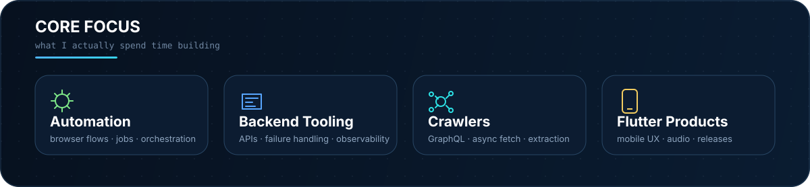
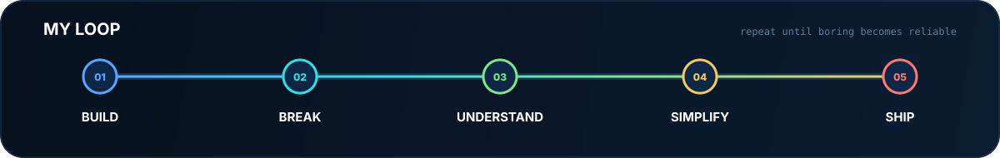

<div align="center">


<br/>

<a href="https://github.com/Soheilll-2006?tab=repositories"></a>
<a href="https://linkedin.com/in/soheilll2006"></a>
<a href="https://t.me/Soheillll_2006"></a>
<a href="mailto:soheilll.2006@gmail.com"></a>

<br/><br/>

<code>automation engineer</code>&nbsp;&nbsp;·&nbsp;&nbsp;<code>python builder</code>&nbsp;&nbsp;·&nbsp;&nbsp;<code>flutter developer</code>

</div>

<br/>



<br/>

<table width="100%">
<tr>
<td width="58%" valign="top">

## `$ whoami`

I build **automation systems, backend tooling, crawlers and mobile products**.

My favorite kind of problem starts with:

> **“Someone is still doing this manually.”**

I care about the parts after the demo works: **timeouts, retries, state, cleanup, failure modes, observability and shipping.**

</td>
<td width="42%" valign="top">

## `$ status`

```yaml
name: Soheil
mode: building
focus:
  - automation
  - backend tooling
  - browser workflows
  - Flutter products
shipping:
  - open-source tools
  - automation systems
```

</td>
</tr>
</table>

---

<div align="center">

## Selected Builds
<sub>Real projects over tutorial repositories.</sub>

</div>

<table>
<tr>
<td width="33%" valign="top">

### 01 · [x-timeline-crawler](https://github.com/Soheilll-2006/x-timeline-crawler)

**GraphQL timeline fetcher + watcher for X**

Snapshot + continuous watch modes with persistent state and pipeline-friendly output.

<sub><code>Python</code> · <code>GraphQL</code> · <code>CLI</code></sub>

<br/><br/>

[**→ Open repository**](https://github.com/Soheilll-2006/x-timeline-crawler)

</td>
<td width="34%" valign="top">

### 02 · [content_automation_core](https://github.com/Soheilll-2006/content_automation_core)

**Production-minded browser automation**

Hardened long-running workflows with bounded calls, cleanup and explicit failure handling.

<sub><code>Python</code> · <code>Selenium</code> · <code>Playwright</code></sub>

<br/><br/>

[**→ Open repository**](https://github.com/Soheilll-2006/content_automation_core)

</td>
<td width="33%" valign="top">

### 03 · [Relationship Telegram Bot](https://github.com/Soheilll-2006/Relationship_telegram_bot)

**Bilingual scheduled Telegram product**

Onboarding, reminders, mood tracking, milestones, streaks and timezone-aware jobs.

<sub><code>Python</code> · <code>SQLite</code> · <code>APScheduler</code></sub>

<br/><br/>

[**→ Open repository**](https://github.com/Soheilll-2006/Relationship_telegram_bot)

</td>
</tr>
</table>

---

<!-- activity:start -->
<div align="center">

## Activity

<sub>Live GitHub data · refreshed automatically</sub>

<table>
<tr>
<td align="center" width="25%">
<a href="https://github.com/Soheilll-2006?tab=overview" title="6,042 contributions year to date">
<strong>6,042</strong><br/>
<sub>Contributions YTD</sub>
</a>
</td>
<td align="center" width="25%">
<a href="https://github.com/search?q=author%3ASoheilll-2006&type=commits" title="29 public commits year to date">
<strong>29</strong><br/>
<sub>Public Commits YTD</sub>
</a>
</td>
<td align="center" width="25%">
<a href="https://github.com/Soheilll-2006?tab=overview" title="Current streak: 6 days · longest in last 365 days: 14 days">
<strong>6 days</strong><br/>
<sub>Current Streak</sub>
</a>
</td>
<td align="center" width="25%">
<a href="https://github.com/Soheilll-2006?tab=overview" title="87 active contribution days in the last 365 days">
<strong>87</strong><br/>
<sub>Active Days · 365d</sub>
</a>
</td>
</tr>
</table>

<a href="https://github.com/Soheilll-2006?tab=overview" title="Open GitHub's native interactive contribution calendar">
<strong>↗ Open interactive contribution graph</strong>
</a>

</div>
<!-- activity:end -->

<br/>


---

<table width="100%">
<tr>
<td width="50%" valign="top">

## Engineering rules

```text
01  automate repetition
02  design for failure
03  keep state explicit
04  measure before guessing
05  ship small
06  improve from real usage
```

</td>
<td width="50%" valign="top">

## I optimize for

- fewer manual steps
- predictable failure behavior
- maintainable architecture
- useful observability
- products that reach real users

</td>
</tr>
</table>

<br/>



<br/>

<div align="center">

### `signal > decoration`

<sub>Metrics above are clickable. Hover for context; click through to GitHub's native activity views.</sub>

<br/><br/>

<a href="https://t.me/Soheillll_2006"></a>
&nbsp;
<a href="mailto:soheilll.2006@gmail.com"></a>

<br/><br/>
<sub>Discipline beats motivation. Every. Single. Time.</sub>

</div>