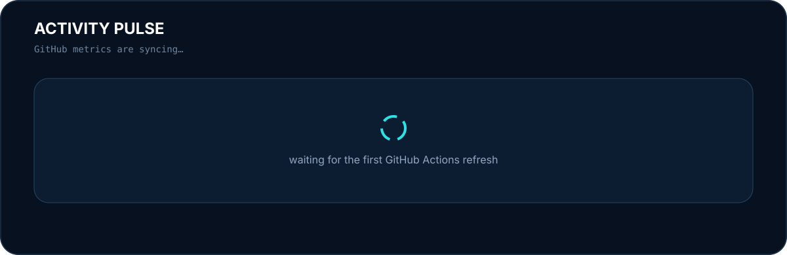

<div align="center">


<br/>

<a href="https://github.com/Soheilll-2006?tab=repositories"></a>
<a href="https://linkedin.com/in/soheilll2006"></a>
<a href="https://t.me/Soheillll_2006"></a>
<a href="mailto:soheilll.2006@gmail.com"></a>

<br/><br/>

<code>automation engineer</code>&nbsp;&nbsp;·&nbsp;&nbsp;<code>python builder</code>&nbsp;&nbsp;·&nbsp;&nbsp;<code>flutter developer</code>

</div>

<br/>


<br/>

<table width="100%">
<tr>
<td width="58%" valign="top">

## `$ whoami`

I build **automation systems, backend tooling, crawlers and mobile products**.

My favorite kind of problem starts with:

> **“Someone is still doing this manually.”**

I care about the parts after the demo works: **timeouts, retries, state, cleanup, failure modes, observability and shipping.**

</td>
<td width="42%" valign="top">

## `$ status`

```yaml
name: Soheil
mode: building
focus:
  - automation
  - backend tooling
  - browser workflows
  - Flutter products
shipping:
  - Divan Khial
  - automation systems
```

</td>
</tr>
</table>

---

<div align="center">

## Selected Builds
<sub>Real projects over tutorial repositories.</sub>

</div>

<table>
<tr>
<td width="50%" valign="top">

### 01 · [x-timeline-crawler](https://github.com/Soheilll-2006/x-timeline-crawler)

**GraphQL timeline fetcher + watcher for X**

Python CLI/library for snapshotting and continuously monitoring timelines with persistent state and machine-friendly output.

```text
snapshot / watch modes
cookie-file sessions
persistent seen-state
JSON + JSONL pipelines
fallback handling
```

[**→ Open repository**](https://github.com/Soheilll-2006/x-timeline-crawler)

</td>
<td width="50%" valign="top">

### 02 · [content_automation_core](https://github.com/Soheilll-2006/content_automation_core)

**Production-minded browser automation**

A hardened toolkit for long-running content workflows where browser hangs, stale sessions and teardown failures actually matter.

```text
bounded WebDriver calls
global timeout controls
safe process cleanup
Playwright + Selenium
observability hooks
```

[**→ Open repository**](https://github.com/Soheilll-2006/content_automation_core)

</td>
</tr>

<tr>
<td width="50%" valign="top">

### 03 · [Relationship Telegram Bot](https://github.com/Soheilll-2006/Relationship_telegram_bot)

**Bilingual scheduled Telegram product**

Persian/English companion bot with onboarding, reminders, mood tracking, milestones, streaks and timezone-aware jobs.

```text
Telegram Bot API
SQLite persistence
APScheduler
bilingual UX
scheduled delivery
```

[**→ Open repository**](https://github.com/Soheilll-2006/Relationship_telegram_bot)

</td>
<td width="50%" valign="top">

### 04 · Divan Khial

**Production Persian poetry audio product**

A Flutter product around Persian poetry, narrated literature and long-form audio.

```text
Flutter + Dart
audio playback
offline behavior
API integrations
release engineering
product iteration
```

<sub>Core repository is private.</sub>

</td>
</tr>
</table>

---



<br/>


---

<table width="100%">
<tr>
<td width="50%" valign="top">

## Engineering rules

```text
01  automate repetition
02  design for failure
03  keep state explicit
04  measure before guessing
05  ship small
06  improve from real usage
```

</td>
<td width="50%" valign="top">

## I optimize for

- fewer manual steps
- predictable failure behavior
- maintainable architecture
- useful observability
- products that reach real users

</td>
</tr>
</table>

<br/>


<br/>

<div align="center">

### `signal > decoration`

<sub>Activity metrics are generated from GitHub data and committed locally — no third-party stats image dependency.</sub>

<br/><br/>

<a href="https://t.me/Soheillll_2006"></a>
&nbsp;
<a href="mailto:soheilll.2006@gmail.com"></a>

<br/><br/>
<sub>Discipline beats motivation. Every. Single. Time.</sub>

</div>