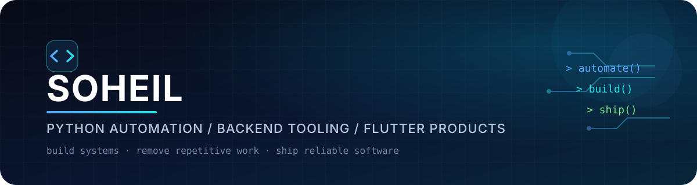

<div align="center">



<br/>

<a href="https://github.com/Soheilll-2006?tab=repositories">
  
</a>
<a href="https://linkedin.com/in/soheilll2006">
  
</a>
<a href="mailto:soheilll.2006@gmail.com">
  
</a>

<br/><br/>

<code>automation engineer</code>
&nbsp;·&nbsp;
<code>python builder</code>
&nbsp;·&nbsp;
<code>flutter developer</code>

</div>

<br/>

<table width="100%">
<tr>
<td width="58%" valign="top">

## `$ whoami`

I build **automation systems, backend tooling, crawlers and mobile products**.

My favorite problems are the ones that start with:

> “Someone is still doing this manually.”

I care about software that survives real usage — timeouts, retries, state, failure modes, cleanup and all the ugly parts after the demo works.

</td>
<td width="42%" valign="top">

## `$ status`

```yaml
name: Soheil
focus:
  - Python automation
  - Backend tooling
  - Browser workflows
  - Flutter products
currently_building:
  - Divan Khial
  - automation systems
learning:
  - security
  - networking
```

</td>
</tr>
</table>

---

<div align="center">

## Selected Builds

<sub>Not tutorial repos. Things I actually built.</sub>

</div>

<table>
<tr>
<td width="50%" valign="top">

### 01 — [x-timeline-crawler](https://github.com/Soheilll-2006/x-timeline-crawler)

**GraphQL timeline fetcher + watcher for X**

A Python CLI/library for snapshotting and continuously monitoring timelines with persistent state and machine-friendly output.

```text
snapshot mode
watch mode
cookie sessions
JSON / JSONL
persistent seen-state
fallback handling
```

<a href="https://github.com/Soheilll-2006/x-timeline-crawler">

</a>

</td>
<td width="50%" valign="top">

### 02 — [content_automation_core](https://github.com/Soheilll-2006/content_automation_core)

**Production-minded browser automation**

A hardened automation toolkit for long-running content workflows across browser-driven platforms.

```text
bounded WebDriver calls
global timeout controls
safe process cleanup
YouTube / TikTok flows
Playwright integration
observability hooks
```

<a href="https://github.com/Soheilll-2006/content_automation_core">

</a>

</td>
</tr>

<tr>
<td width="50%" valign="top">

### 03 — [Relationship Telegram Bot](https://github.com/Soheilll-2006/Relationship_telegram_bot)

**Bilingual, scheduled Telegram product**

A Persian/English companion bot with onboarding, scheduled delivery, reminders, mood tracking, milestones and streak logic.

```text
Python
Telegram Bot API
SQLite
APScheduler
timezone-aware jobs
bilingual UX
```

<a href="https://github.com/Soheilll-2006/Relationship_telegram_bot">

</a>

</td>
<td width="50%" valign="top">

### 04 — Divan Khial

**Persian poetry audio product**

A production Flutter app focused on Persian poetry, narrated literature and long-form audio.

```text
Flutter / Dart
audio playback
offline behavior
API integrations
release engineering
product iteration
```

<sub>Core repository is private.</sub>

</td>
</tr>
</table>

---

<div align="center">

## Stack I Reach For


<br/><br/>

`Playwright`
&nbsp;·&nbsp;
`Asyncio`
&nbsp;·&nbsp;
`aiohttp`
&nbsp;·&nbsp;
`BeautifulSoup`
&nbsp;·&nbsp;
`REST APIs`
&nbsp;·&nbsp;
`GraphQL`
&nbsp;·&nbsp;
`GitHub Actions`

</div>

---

<table width="100%">
<tr>
<td width="50%" valign="top">

## Engineering Rules

```text
01. automate repetition
02. design for failure
03. keep state explicit
04. measure before guessing
05. ship small
06. improve from real usage
```

</td>
<td width="50%" valign="top">

## What I Optimize For

- fewer manual steps
- predictable failure behavior
- maintainable architecture
- useful observability
- products that reach real users

</td>
</tr>
</table>

---

<div align="center">

## GitHub Signal


<br/>

<sub>Stats are secondary. The repositories above are the portfolio.</sub>

</div>

---

<div align="center">

### `build → break → understand → simplify → ship`

<br/>

<a href="https://t.me/Soheillll_2006">
  
</a>
&nbsp;
<a href="mailto:soheilll.2006@gmail.com">
  
</a>

<br/><br/>

<sub>Discipline beats motivation. Every. Single. Time.</sub>

</div>
